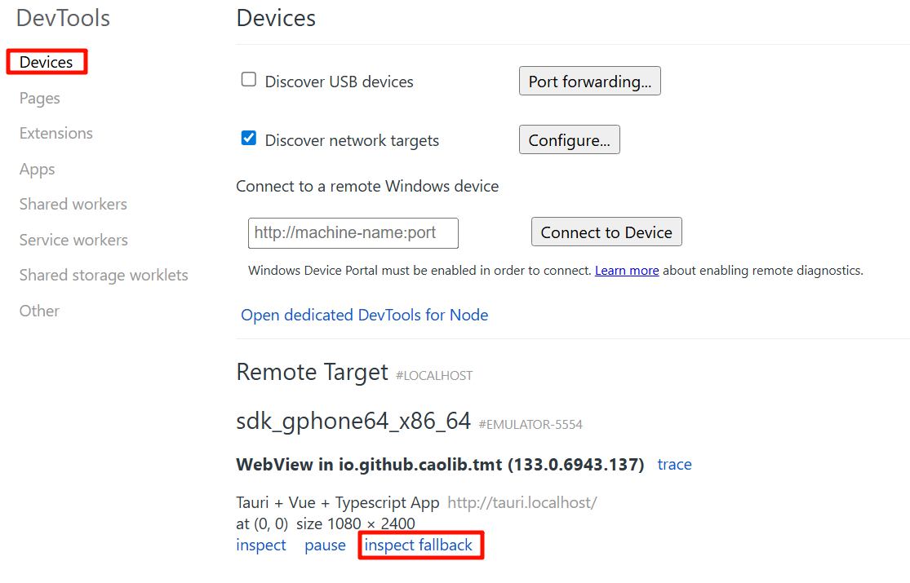

# 一个Tauri2 + Vue3 + Ant Design Vue 的安卓 应用模板

## 初始化

1. 安装依赖
```shell
pnpm i
```

2. 初始化安卓环境，环境要求见[前置要求 | Tauri](https://tauri.app/zh-cn/start/prerequisites/#android)
```shell
pnpm tauri android init
```

2. 启动开发服务器
```shell
pnpm start
```

## 调试

浏览器输入 `chrome://inspect` 后可以使用开发工具进行调试，Edge或Chrome浏览器都可以
